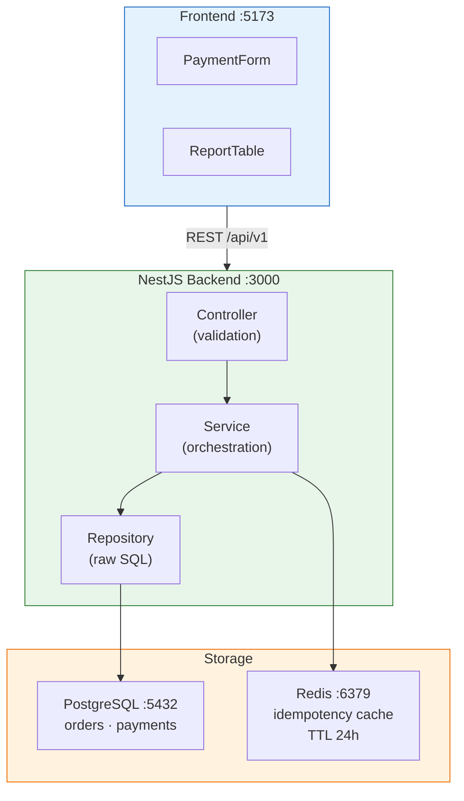
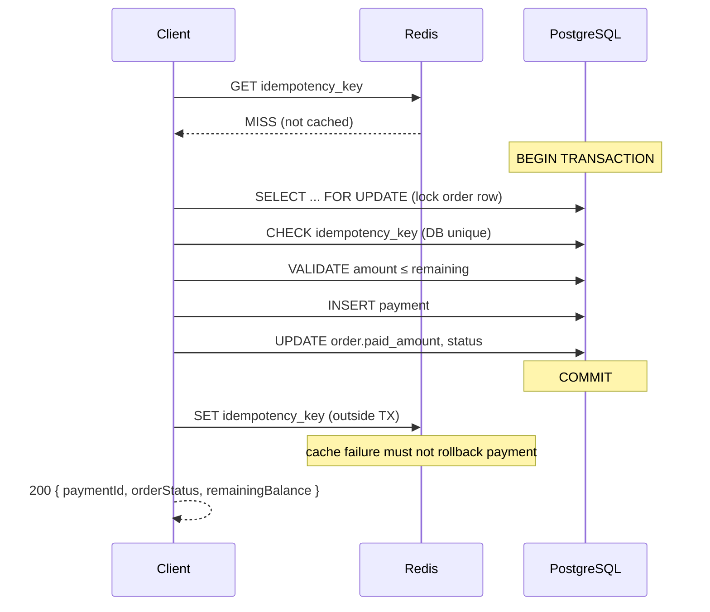
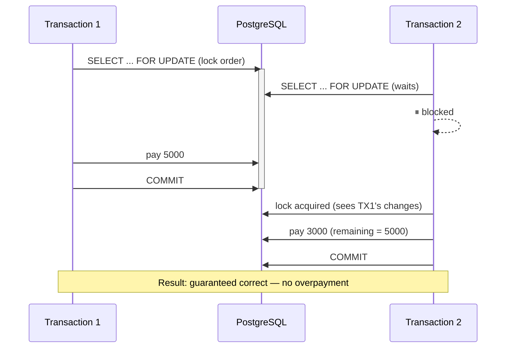

# Finance Transaction Module

[](https://github.com/AlSokolov2/finance-transaction-module/actions/workflows/ci.yml)
[](https://github.com/microsoft/TypeScript)
[](https://nodejs.org/)
[](https://nestjs.com/)
[](https://www.postgresql.org/)
[](https://redis.io/)
[](https://react.dev/)
[](./LICENSE)

Модуль учёта финансовых транзакций по заказам. Тестовое задание, демонстрирующее архитектурный подход к ACID-транзакциям, конкурентной обработке платежей, идемпотентности и защите от переплаты.

## Ключевые технические решения

| Проблема | Решение | Почему |
|----------|---------|--------|
| Конкурентные платежи | `SELECT ... FOR UPDATE` (pessimistic lock) | Гарантия отсутствия переплаты без retry-логики на клиенте |
| Повторные списания (дубли) | Два уровня: Redis (быстрый) + PostgreSQL UNIQUE (надёжный) | 90%+ повторов ловится в кэше, остальные — на уровне БД |
| Точность финансовых данных | `DECIMAL(15,2)`, не `FLOAT` | Отсутствие ошибок округления на копейках |
| Проверка остатка | `paid_amount` денормализован в `orders` | Один запрос вместо `SUM(payments)` при каждом платеже |
| Переплата | 409 Conflict, запрет | Соответствует бизнес-контексту фиксированных сумм |

## Архитектура



### Поток обработки платежа



## Быстрый старт

```bash
# 1. Поднять окружение (PostgreSQL + Redis + Backend + Frontend)
docker compose up -d

# 2. Заполнить тестовыми данными (12 заказов)
docker compose exec backend npm run seed

# 3. API
curl http://localhost:3000/api/v1/orders/report

# 4. Фронтенд
open http://localhost:5173

# 5. Тесты
docker compose exec backend npm test
```

## API

### `POST /api/v1/payments` — Добавить платёж

```json
// Request
{
  "orderId": "550e8400-e29b-41d4-a716-446655440000",
  "amount": 5000.00,
  "idempotencyKey": "a1b2c3d4-e5f6-7890-abcd-ef1234567890"
}

// 200 — Новый платёж или идемпотентный повтор
{
  "paymentId": "uuid",
  "orderId": "uuid",
  "amount": 5000.00,
  "orderStatus": "partially_paid",
  "remainingBalance": 10000.00
}

// 409 — Переплата
{ "statusCode": 409, "message": "Payment amount exceeds remaining balance. Remaining: 3000.00" }

// 409 — Конфликт идемпотентности
{ "statusCode": 409, "message": "Idempotency key already used with different payload" }
```

### `GET /api/v1/orders/report` — Сводный отчёт

```json
{
  "orders": [
    { "orderId": "uuid", "totalAmount": 15000, "paidAmount": 5000, "remaining": 10000, "status": "partially_paid" }
  ],
  "totals": { "totalAmount": 216300, "totalPaid": 13000, "totalRemaining": 203300 }
}
```

## Модель данных

```sql
CREATE TABLE orders (
    id           UUID PRIMARY KEY DEFAULT gen_random_uuid(),
    total_amount DECIMAL(15,2) NOT NULL CHECK (total_amount > 0),
    status       VARCHAR(20) NOT NULL DEFAULT 'pending'
                 CHECK (status IN ('pending', 'partially_paid', 'paid')),
    paid_amount  DECIMAL(15,2) NOT NULL DEFAULT 0.00,
    created_at   TIMESTAMP NOT NULL DEFAULT NOW(),
    updated_at   TIMESTAMP NOT NULL DEFAULT NOW()
);

CREATE TABLE payments (
    id              UUID PRIMARY KEY DEFAULT gen_random_uuid(),
    order_id        UUID NOT NULL REFERENCES orders(id),
    amount          DECIMAL(15,2) NOT NULL CHECK (amount > 0),
    idempotency_key VARCHAR(64) UNIQUE NOT NULL,
    created_at      TIMESTAMP NOT NULL DEFAULT NOW()
);

CREATE INDEX payments_order_id_idx ON payments(order_id);
CREATE INDEX payments_idempotency_idx ON payments(idempotency_key);
```

### Обоснование структуры

- **`paid_amount` денормализован** — проверка остатка без `SUM(payments)` на каждый запрос. Обновляется атомарно в той же транзакции, что и INSERT платежа
- **Отдельная таблица `payments`** — каждый платёж — иммутабельная запись для аудита и сверки. `payments` — источник правды, `paid_amount` — кэш
- **`DECIMAL(15,2)`** — точная арифметика для финансов. Никаких `FLOAT` / `DOUBLE` и ошибок округления
- **UUID PK** — безопаснее автоинкремента для API: нельзя перебрать ID заказов

## Защита от конкурентных запросов

### Почему pessimistic, а не optimistic lock



Оптимистическая блокировка потребовала бы retry-логики на клиенте — для платёжных операций это рискованно.

## Идемпотентность

Два уровня защиты от дублирования платежей:

```
Уровень 1 — Redis (быстрый)
  idempotency_key → кэшированный результат
  TTL: 24 часа
  Назначение: избежать обращения к БД для 90%+ повторов

Уровень 2 — PostgreSQL UNIQUE (надёжный)
  UNIQUE CONSTRAINT на payments.idempotency_key
  Назначение: последний рубеж, даже если Redis перезапущен
```

Redis-кэш записывается **вне транзакции** намеренно: сбой кэша не должен откатывать совершённый платёж. БД — единственный источник правды.

## Тесты

```bash
docker compose exec backend npm test
```

| Тест | Сценарий | Проверка |
|------|---------|----------|
| Concurrent overpayment | 5 × 4000 на заказ в 10000 | 2 успеха, 3 отказа (409), `paid_amount ≤ total_amount` |
| Idempotent replay | Тот же ключ + payload | 200, тот же `payment_id`, одна запись в БД |
| Idempotency conflict | Тот же ключ + другой amount | 409 Conflict |

## Стек

| Слой | Технология |
|------|-----------|
| Backend | NestJS 10 + TypeScript 5.5 (strict) |
| Database | PostgreSQL 16 + DECIMAL для финансов |
| Cache | Redis 7 |
| Frontend | React 18 + TypeScript + Vite |
| Tests | Vitest |
| Infra | Docker Compose (4 сервиса) |
| CI/CD | GitHub Actions |

## Структура проекта

```
finance-module/
├── .github/workflows/ci.yml        # CI: lint → test → build
├── docker-compose.yml              # PostgreSQL + Redis + Backend + Frontend
├── backend/
│   ├── src/
│   │   ├── orders/                 # GET /orders/report
│   │   ├── payments/               # POST /payments (основная логика)
│   │   ├── redis/                  # Idempotency cache (RedisService)
│   │   ├── database/seeds/         # 12 тестовых заказов
│   │   └── common/exceptions/      # OverpaymentException, IdempotencyConflict
│   └── test/
│       └── concurrency.spec.ts     # 3 конкурентных теста
└── frontend/
    └── src/
        ├── components/
        │   ├── PaymentForm.tsx      # Форма оплаты с авто-генерацией idempotency key
        │   ├── ReportTable.tsx      # Сводная таблица с итоговой строкой
        │   └── StatusBadge.tsx      # Цветной бейдж статуса
        └── services/api.ts         # Axios-клиент
```

## Что сделал бы иначе при сжатии сроков в 2 раза

| Компонент | Экономия | Цена |
|-----------|---------|------|
| NestJS → Express.js | ~1 день | Меньше структуры, сложнее расширять |
| Без Redis (idempotency только в БД) | ~0.5 дня | Повторы всегда ходят до БД |
| Без фронтенда (только API + curl) | ~1.5 дня | Нет визуальной демонстрации |
| SQLite вместо PostgreSQL | ~0.5 дня | Нет production-готовности |
| Готовая idempotency-библиотека | ~0.5 дня | Зависимость от стороннего кода |

**Итого: ~4 дня экономии ценой production-готовности и расширяемости.**
Для тестового задания — приемлемо. Для реального проекта — нет.

## Лицензия

Noncommercial use only. См. [LICENSE](./LICENSE). Для коммерческого использования — свяжитесь с автором.
